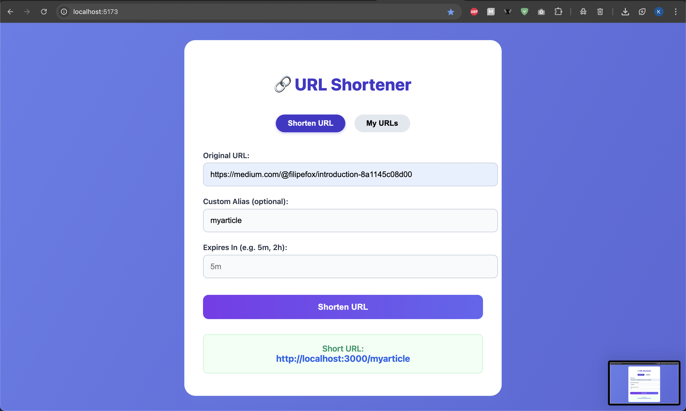

# URL Shortener

A full-stack URL shortener built with React, Express/Node.js, PostgreSQL, and Redis — all in TypeScript.
Supports custom aliases + expiration time

---

## Features

- Shorten URLs with optional custom aliases
- Set expiration for shortened URLs
- Fast redirects with Redis caching
- REST API with validation
- Dockerized for easy local development

---



## Project Structure

```
url-shortener/
├── client/         # React frontend (Vite)
├── server/         # Express backend
├── docker-compose.yml
```

---

## Prerequisites

- [Docker](https://www.docker.com/) and [Docker Compose](https://docs.docker.com/compose/)
- (Optional for local dev) Node.js 18+ and npm

---

## Getting Started

### 1. Clone the repository

```sh
git clone https://github.com/nailyk/url-shortener.git
cd url-shortener
```

---

### 2. Start the application locally

```sh
npm run dev
```

- Frontend: [http://localhost:8080](http://localhost:8080)
- Backend/API: [http://localhost:3000](http://localhost:3000)

---

## Informations

- PostgreSQL is used for persistent storage.
- Redis is used for caching and short code generation (using REDIS INCR coupled with sqid)
- Database schema is initialized from `server/src/config/db-init.sql`.

---

## Author

[Kylian Deau](https://github.com/nailyk)
